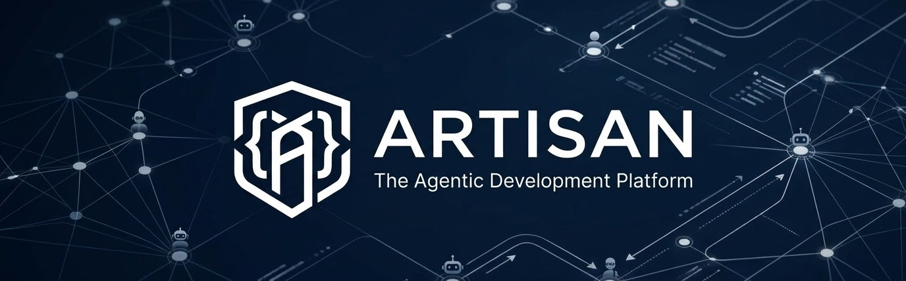
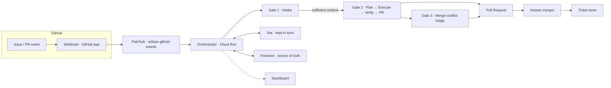
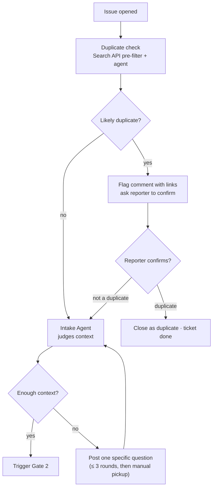
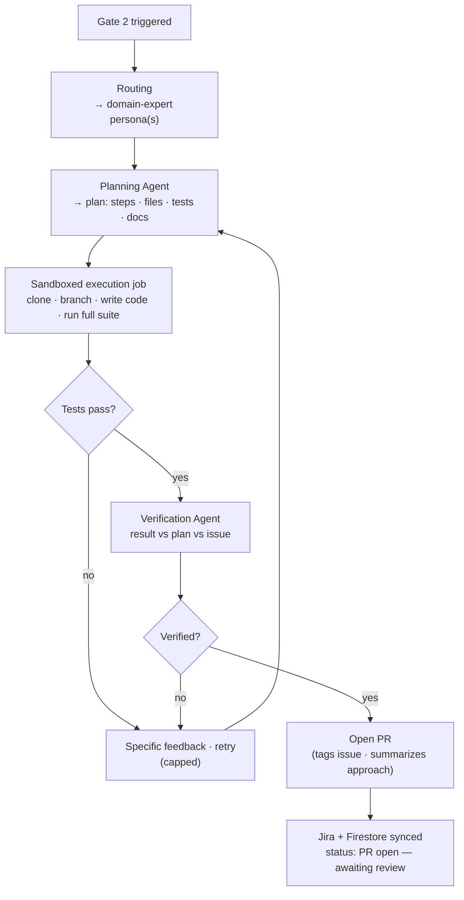
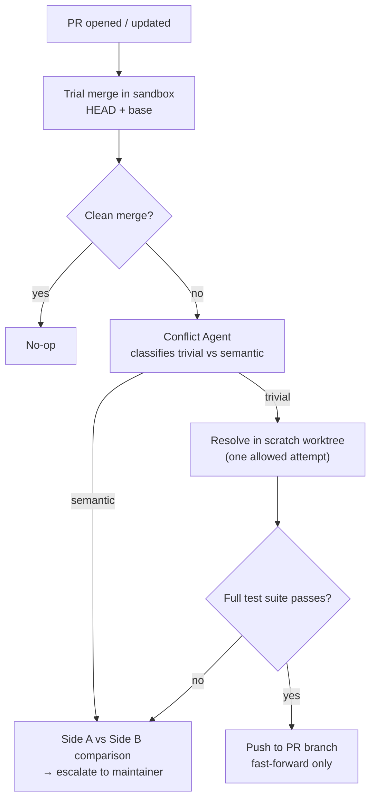
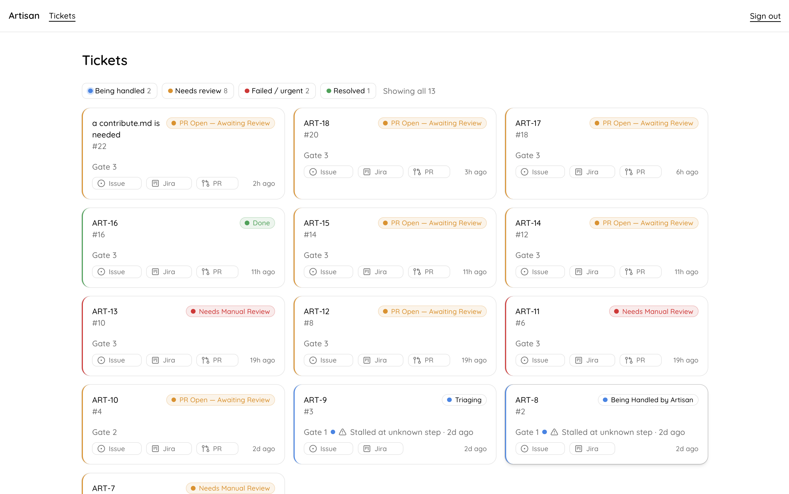
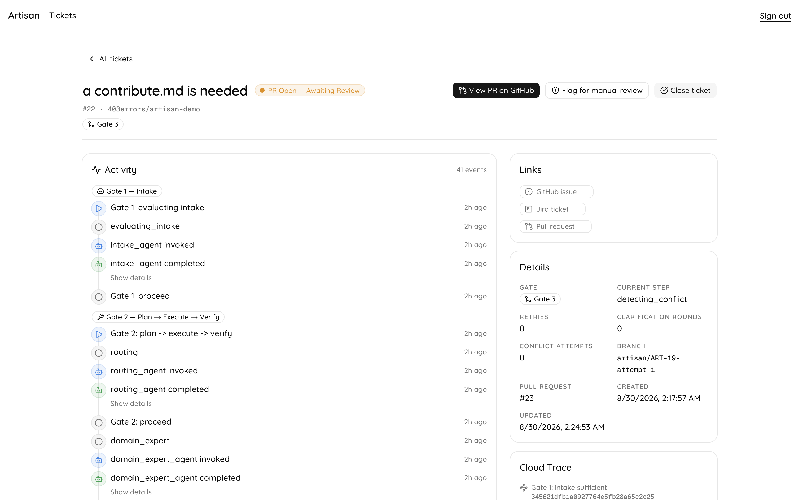

<p align="center">
  
</p>

<div align="center">


  **The Agentic Development Platform** — an expert co-developer that closes the loop between
  your coding-agent fleet and Jira.

  [](https://github.com/403errors/artisan/actions/workflows/ci.yml)
  [](LICENSE)
  [](https://www.python.org/)
  [](https://docs.astral.sh/uv/)
  [](https://nextjs.org/)

</div>

Artisan watches a GitHub repo's issues and PRs via webhooks and drives each one through three
gates — **GitHub issue in, reviewed PR out, Jira kept in sync throughout** — so no human has to
shuttle context between a coding agent and a ticket tracker.

## Features

- **Duplicate-aware intake** — before acting, Artisan checks a new issue against open ones, flags
  likely duplicates with links, and only proceeds after you confirm. It never auto-closes anything.
- **Plan → Execute → Verify → PR** — an issue becomes a plan, the plan is executed in an isolated
  sandbox, and only a verified result with a passing test suite becomes a reviewable PR.
- **Merge-conflict triage** — trivial conflicts are auto-resolved only when the full test suite
  passes; conflicts that need a judgment call about intent are escalated with both sides laid out.
- **Jira kept in sync end-to-end** — tickets move from *To Do* to an open PR with comments and
  links, with no manual status editing.
- **Full decision audit trail + dashboard** — every gate decision (proceed / ask / escalate) is
  traced and visible in a dashboard, so you can always answer *"why did Artisan do that?"*

## How it works



### Gate 1 · Intake — duplicate-aware by design

Every new issue is checked against the repo's open issues *before* anything happens. A Search API
pre-filter finds candidates, an agent scores true overlap, and only **you** decide whether a
duplicate is really a duplicate.



### Gate 2 · Plan → Execute → Verify → PR — security first

No code ever touches a shared machine and no PR opens on a guess. Execution happens in an
ephemeral Cloud Run Job; the full test suite must pass; a verification agent checks the result
against the plan and the original issue — *then* a PR is opened.



Safety invariants:

- **Sandboxed execution** — the coding agent runs in an ephemeral Cloud Run Job with bounded
  tools; no shelled-out external coding CLIs.
- **No force-push, no self-merge** — a human merge is the only path to *Done*.
- **Bounded retries, then escalation** — never an infinite retry loop.

### Gate 3 · Merge-conflict triage — never guesses on intent

Artisan runs its own authoritative trial-merge (not GitHub's stale `mergeable_state`) and
classifies the conflict. Trivial ones are resolved in a scratch worktree — and only pushed if the
full suite passes. Semantic conflicts are always escalated, with both sides laid out.



## Screenshots

<p align="center">
  
  
</p>

*Left: the dashboard at a glance. Right: drill into any ticket to see every gate decision.*

## Quick start

```bash
# 1. Sync the whole uv workspace (agents + execution-sandbox + artisan_shared)
uv sync

# 2. Run the orchestrator's test suite
uv run --package artisan-agents pytest

# 3. Run the dashboard
cd dashboard && pnpm install && pnpm dev   # http://localhost:3000
```

Full local setup, env vars, and Cloud deploy instructions live in
[`docs/DEPLOYMENT.md`](./docs/DEPLOYMENT.md).

## Repo layout

```
agents/                    Python — orchestrator + all ADK agents
execution-sandbox/         Python — Cloud Run Job image (Execution Agent runtime)
packages/artisan_shared/   Python — shared models / Firestore id-scheme / GitHub auth
dashboard/                 TypeScript — Next.js monitoring dashboard
infra/                     Deploy config (Dockerfiles, Terraform/gcloud)
docs/                      Living project docs
```

`agents/`, `execution-sandbox/`, and `packages/artisan_shared/` are three members of one `uv`
workspace (root `pyproject.toml`) — `packages/artisan_shared/` holds the typed models and Firestore
ticket-id scheme both Python projects need to stay in sync on (see
[TECH_STACK.md](./docs/TECH_STACK.md)). Run `uv sync` from the repo root to sync every member at
once.

## Setup

### Agents (`agents/`)

```bash
uv sync                              # from the repo root — syncs the whole workspace
uv run ruff check agents execution-sandbox packages   # ruff lint across the workspace
uv run --package artisan-agents pytest
cd agents && uv run artisan-agents   # serves on :8080 (or $PORT)
```

Requires GCP Application Default Credentials (`gcloud auth application-default login`) for
Firestore/Secret Manager/Pub/Sub access, plus env vars — see
[`docs/DEPLOYMENT.md`](./docs/DEPLOYMENT.md#environment-variables).

### Execution sandbox (`execution-sandbox/`)

```bash
uv sync
uv run --package artisan-execution-sandbox pytest
```

### Dashboard (`dashboard/`)

Requires a GitHub OAuth App and `dashboard/.env.local` — see
[`docs/DEPLOYMENT.md`](./docs/DEPLOYMENT.md#dashboard-dashboard).

```bash
cd dashboard
pnpm install
pnpm test        # Vitest + React Testing Library
pnpm build
pnpm dev          # http://localhost:3000
```

### Secrets & deployment

All secrets live in Google Secret Manager, scoped per-secret to the service account that needs it
— never as literals in code. Build and deploy commands for Cloud Run are in
[`docs/DEPLOYMENT.md`](./docs/DEPLOYMENT.md).

## Docs

- [PRD.md](./docs/PRD.md) — what & why
- [SYSTEM_DESIGN.md](./docs/SYSTEM_DESIGN.md) — how it's built
- [TECH_STACK.md](./docs/TECH_STACK.md) — exact versions
- [SPRINT.md](./docs/SPRINT.md) — sprint plan
- [MILESTONE.md](./docs/MILESTONE.md) — closed-sprint DoD archive
- [CONTEXT.md](./docs/CONTEXT.md) — current state (read this first)
- [DEPLOYMENT.md](./docs/DEPLOYMENT.md) — deployment & operations

## License

[MIT](./LICENSE) © 2026 Sameer Verma
