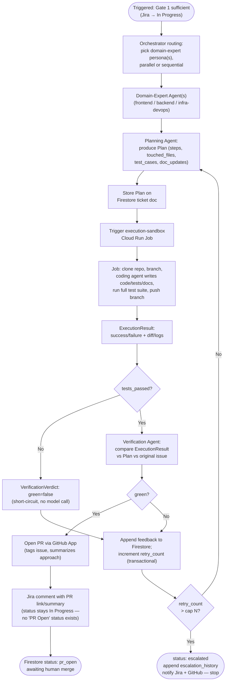
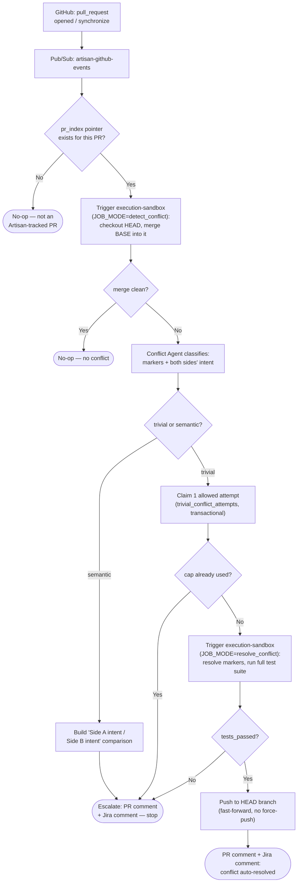

# Artisan — System Design

Companion to [PRD.md](./PRD.md) (what/why) and [TECH_STACK.md](./TECH_STACK.md) (exact versions). This document is the "how": components, data flow, contracts, and state.

## 1. Architecture Overview

```
GitHub repo (issues, issue_comment, pull_request events)
        │  webhook (GitHub App)
        ▼
  Pub/Sub topic: artisan-github-events
        │  push subscription
        ▼
┌───────────────────────────────────────────────────────────┐
│ Cloud Run service: orchestrator                            │
│  - Gate 1: Intake Agent                                    │
│  - Gate 2: routes to Domain-Expert → Planning →            │
│            Execution → Verification agents                 │
│  - Gate 3: Conflict Agent                                   │
│  - All agents: ADK, Gemini 3.7 Flash                        │
└───────────────────────────────────────────────────────────┘
   │              │                    │                │
   ▼              ▼                    ▼                ▼
Firestore    Secret Manager     Cloud Run Jobs      Jira Cloud
(ticket       (GitHub App key,   "execution-        REST API
 state)       Jira token)        sandbox" — one      (direct,
                                 job per attempt:     API-token
                                 clone repo, run      Basic Auth)
                                 plan, run tests,
                                 push branch
   │
   ▼
OpenTelemetry → Cloud Trace / Cloud Logging (every gate decision)

┌───────────────────────────────────────────────────────────┐
│ Next.js dashboard (Cloud Run service)                       │
│  - GitHub OAuth login (repo/issue access as the signed-in   │
│    user)                                                     │
│  - Reads ticket state from Firestore (server-side)          │
│  - Jira status shown via Artisan's own service-account       │
│    credentials (Jira API token) — not the dashboard user's   │
│    personal Jira login                                       │
└───────────────────────────────────────────────────────────┘
```

## 2. Components

| Component | Role | Runs on |
|---|---|---|
| GitHub App | Source of truth for issues/PRs; webhook emitter; PR/comment writer | GitHub |
| Pub/Sub (`artisan-github-events`) | Decouples webhook receipt from processing; at-least-once delivery | Google Cloud |
| Orchestrator service | Owns all 3 gates; hosts Intake, Domain-Expert, Planning, Verification, Conflict agents (all reasoning-only); calls Jira Cloud REST API directly | Cloud Run (service) |
| Execution sandbox | Ephemeral compute that checks out the repo, runs a bounded ADK function-calling agent to write code/tests/docs (own tools: read/write/list/shell + a `finish` signal — never ADK's built-in `bash_tool`, which requires human confirmation per call and would stall unattended), runs the test suite, pushes a branch | Cloud Run Jobs |
| Firestore | Single source of truth for per-ticket state | Google Cloud (native mode) |
| Secret Manager | GitHub App private key, webhook secret, Jira API token | Google Cloud |
| OpenTelemetry → Cloud Trace/Logging | Every gate decision traced (proceed / ask / escalate) | Google Cloud |
| Dashboard | Human-facing view of ticket state, scoped to one repo + board | Cloud Run (service) |

> **Superseded (Sprint 2):** an `mcp-atlassian` MCP server (Cloud Run, internal-only ingress) originally sat between the orchestrator and Jira, per the original design. It was dropped after live testing surfaced an unresolved auth bug in the pinned `sooperset/mcp-atlassian:0.23.1` image itself — two independently-verified-valid API tokens both failed identically through it while succeeding via direct REST calls with the same credentials. The orchestrator now calls Jira Cloud's REST API directly (`agents/src/artisan_agents/jira/client.py`); see `docs/CONTEXT.md` for the full diagnosis. The `mcp-atlassian` Cloud Run service was deleted once this was confirmed (it pulled a public image, so nothing custom was lost).

## 3. Data Flow — Gate 1 (Intake)

1. GitHub emits an `issues` (opened) or `issue_comment` (created) event → GitHub App webhook → Pub/Sub.
2. Orchestrator's Pub/Sub handler deduplicates on GitHub's `X-GitHub-Delivery` header (idempotency key stored in Firestore) and loads/creates the ticket's Firestore document.
3. If the ticket has no Jira key yet, the orchestrator creates one via a direct Jira Cloud REST API call and stores the mapping.
4. Intake Agent reads the GitHub issue thread + Jira ticket and returns a structured verdict: `sufficient` or `insufficient` (with a specific question).
5. **Sufficient:** Jira ticket transitions to *In Progress*; Gate 2 is triggered.
6. **Insufficient:** Artisan posts the specific question as a GitHub issue comment, increments `clarification_rounds` in Firestore, and stops. A reply re-triggers step 4. After 3 rounds still insufficient, the ticket is flagged `manual_pickup` and Jira is annotated accordingly — no further automated attempts.

**Flowchart:**


## 4. Data Flow — Gate 2 (Plan → Execute → Verify → PR)

1. Orchestrator (Gemini 3.7 Flash, high-thinking) decides which domain-expert persona(s) apply (frontend / backend / infra-devops) and whether they run in parallel or in sequence.
2. Domain-expert output (refined technical description) → Planning Agent → a plan (steps, touched files, test cases, doc updates) stored on the Firestore ticket doc.
3. Orchestrator triggers a Cloud Run Job (`execution-sandbox`) with the plan and repo reference as job args (`agents/gcp/cloud_run_jobs.py`, via env-var overrides on a synchronous `run_job(...).result()` call — Cloud Run supports request timeouts up to 60 minutes, so this needs no separate async completion signal at this scope). The job (`execution-sandbox/`): clones the repo, creates a branch, runs a bounded ADK function-calling agent against the plan to write code/tests/docs (never a shelled-out external coding CLI, per PRD §5's non-goal), runs the full test suite, pushes the branch, and writes a structured `ExecutionResult` (success + diff, or failure + logs) directly onto the ticket's Firestore doc for the orchestrator to read back.
4. Verification Agent compares the job's result against the plan and the original issue (short-circuiting to a failed verdict without a model call when the test run itself failed — a red test run can never be verified green).
   - **Green + tests pass:** orchestrator opens the PR (via GitHub App), tagging the issue and summarizing the approach; mirrors the summary as a Jira comment. **Jira status is not transitioned on this path** — this Jira site's real team-managed Kanban workflow only has `Backlog`/`Selected for Development`/`In Progress`/`Done` (confirmed live against `ART-8`/`ART-9` in Sprint 3), with no "PR Open — Awaiting Review" status to move into; the ticket stays *In Progress* in Jira, and the PR link/summary is communicated via the comment instead. Firestore's own `TicketDoc.status` still tracks `"pr_open"` precisely — it, not Jira's coarser workflow, is the source of truth for this state.
   - **Failed verification or failed tests:** specific feedback is appended to the ticket's Firestore doc, `retry_count` increments transactionally (same commit-then-raise shape as Gate 1's clarification cap), and the loop returns to step 2 (Planning) with that feedback in context.
5. On exceeding the retry cap, the ticket is flagged `escalated` with the last failure appended to `escalation_history` (an atomic `firestore.ArrayUnion`, not read-modify-write), and Jira/GitHub are notified — no further automated retries.

**Flowchart:**



## 5. Data Flow — Gate 3 (Merge Conflicts)

1. `pull_request` webhook (`opened`/`synchronize`) → Pub/Sub → orchestrator. The orchestrator resolves the PR number to its owning ticket via the `pr_index/{repo}__{prNumber}` pointer doc (written when Gate 2 opens the PR); a PR with no pointer isn't Artisan's concern and is a no-op — Artisan never operates on repo state it doesn't own (PRD.md §5).
2. **Detection is Artisan's own authoritative trial-merge, not GitHub's `mergeable_state`** — that field is computed asynchronously and is frequently stale/null right when the webhook fires, which is unacceptable for a must-be-live demo. Orchestrator triggers the `execution-sandbox` Cloud Run Job in `detect_conflict` mode: it clones the repo, checks out the PR's **head** branch, fetches and merges the **base** branch into it (`--no-commit --no-ff`). Checking out head and merging base into it — never the reverse — is deliberate: merging head into a base checkout produces a commit that isn't a fast-forward of head, so pushing the fix back would require a force-push, which PRD.md §5 forbids. Clean → no-op, nothing to do. Conflicted → the job also gathers the base branch's recent history for the conflicted files (side B's intent) so the classification step doesn't need a second GitHub API round-trip.
3. Conflict Agent classifies the conflict from the diff, conflict markers, and both sides' stated intent (the PR's own title/body vs. the base branch's recent history): `trivial` or `semantic`.
4. **Trivial:** the orchestrator transactionally claims Gate 3's one allowed resolution attempt (`trivial_conflict_attempts`, capped at 1 — claimed *before* the attempt runs, unlike Gate 2's retry cap which gates the *next* attempt after a failure) and triggers `execution-sandbox` in `resolve_conflict` mode: it re-does the same trial merge, runs the bounded conflict-resolution coding agent against the conflict markers if still conflicted, and only pushes if the full test suite passes. Any failure — cap already used, the merge job crashing, or the resolution's tests failing — escalates immediately; there is no retry loop like Gate 2's.
5. **Semantic:** no resolution is attempted at all. Artisan posts a structured comparison ("Side A intent" vs "Side B intent," never a raw diff dump) as a PR comment and escalates to the maintainer.
6. Every escalation (semantic, or a failed/capped trivial attempt) posts to **both** GitHub (a PR comment) and Jira with matching full-detail content, per §9's cross-cutting rule — because the relevant actor here (whoever's reviewing that PR) is GitHub-native and may have no Jira access at all. Gate 2's own escalation path (retry cap exceeded) posts a short reporter-facing GitHub *issue* comment (no PR exists yet at that point) plus the full diagnostic detail in Jira — content differs by design, not a gap; see §9.

**Flowchart:**



## 6. API Contracts

### 6.1 Pub/Sub message (from GitHub webhook)
```json
{
  "delivery_id": "string (GitHub X-GitHub-Delivery, idempotency key)",
  "event": "issues | issue_comment | pull_request",
  "action": "opened | created | synchronize | closed | ...",
  "repo": "owner/name",
  "payload": { "...": "raw GitHub webhook payload, unmodified" }
}
```

### 6.2 ADK agent I/O (all agents exchange typed Pydantic models, not free text)

```python
class IntakeVerdict(BaseModel):
    sufficient: bool
    missing_context_question: str | None = None

class DomainExpertOutput(BaseModel):
    domain: Literal["frontend", "backend", "infra-devops"]
    technical_summary: str
    relevant_files: list[str]

class RemovedCodeItem(BaseModel):
    file: str
    symbol: str
    reason: str

class Plan(BaseModel):
    steps: list[str]
    touched_files: list[str]
    test_cases: list[str]
    doc_updates: list[str]
    removed_code: list[RemovedCodeItem] = []

class ExecutionResult(BaseModel):
    branch: str
    diff_summary: str
    tests_passed: bool
    logs_uri: str

class VerificationVerdict(BaseModel):
    green: bool
    feedback: str | None = None

class ConflictVerdict(BaseModel):
    classification: Literal["trivial", "semantic"]
    resolution_branch: str | None = None
    comparison: str | None = None

class ConflictDetectionResult(BaseModel):
    has_conflict: bool
    conflicted_files: list[str]
    conflict_markers: str
    base_branch_history: str
    diff_summary: str
    logs_uri: str
    head_sha: str
```

### 6.3 Dashboard read API (Next.js route handlers, server-side only)
- `GET /api/tickets` → list of ticket summaries (id, Jira key, GitHub issue #, status, current gate, current step, last decision).
- `GET /api/tickets/:id` → full ticket doc: decision trail, retry/clarification counts, PR link, trace links.
- `GET /api/tickets/stream` and `GET /api/tickets/:id/stream` (Sprint 5) → SSE variants of the same two reads, bridging a server-side Firestore `onSnapshot` listener to the browser via `EventSource` — additive live variants of the same data contract, not a new schema. `stream` accepts an optional `?status=a,b` filter (used by `/escalations`).
- All routes require an authenticated session (GitHub OAuth) and read from Firestore server-side — the browser never talks to Firestore directly. Page routes (`/tickets`, `/escalations`, `/tickets/:id`) redirect an unauthenticated request to `/signin`; the `/api/tickets*` routes instead return a plain `401` — deliberately *not* middleware-based (Auth.js v5's `callbacks.authorized` affects every `auth()` call app-wide, not just requests a middleware matcher scopes it to, which would have turned every API 401 into an unusable redirect) — each page/route calls `auth()` directly instead (`dashboard/src/lib/require-session.ts` for pages).

### 6.4 Firestore document schema — `tickets/{ticketId}`
```
{
  github_issue_number: number,
  github_repo: string,
  jira_key: string,
  status: "intake" | "in_progress" | "pr_open" | "escalated" | "manual_pickup" | "done",
  current_step: string | null,
  clarification_rounds: number,
  retry_count: number,
  domains: string[],
  plan: Plan | null,
  last_execution_result: ExecutionResult | null,
  pr_url: string | null,
  pr_number: number | null,
  trivial_conflict_attempts: number,
  semantic_conflict_escalated: boolean,
  last_conflict_detection: ConflictDetectionResult | null,
  last_conflict_resolution: ExecutionResult | null,
  escalation_history: [{ at: timestamp, reason: string, gate: "1"|"2"|"3" }],
  trace_ids: string[],
  processed_delivery_ids: string[],
  created_at: timestamp,
  updated_at: timestamp
}
```
`current_step` (Sprint 5) is a display-only progress hint for the dashboard's live view — e.g.
`"planning (attempt 2)"`, `"executing (attempt 2)"`, `"detecting_conflict"` — written by
`dispatch.py`/`gate2.py`/`gate3.py` at each sub-step transition via the existing generic
`update_ticket(**fields)`, not a new Firestore function. It's a plain `str | None`, not a
`Literal` enum like `status`, since it's informational rather than control-flow-branching; a stale
value left behind after a gate completes is harmless because the dashboard only reads it while
`status` is `intake`/`in_progress`. `processed_delivery_ids` is a real field in the Pydantic model
but currently unwritten/unread anywhere in the codebase — flagged here as dead code, not removed
(out of scope for Sprint 5).
`last_conflict_resolution` is the same `ExecutionResult` shape Gate 2 writes to
`last_execution_result`, kept in a separate field so the two histories stay distinguishable in the
Sprint 5 dashboard's decision trail.

Idempotency is tracked separately, not as a field here — see the top-level
`processed_deliveries/{delivery_id}` collection in §7, which exists (and must be checked)
*before* a ticket doc necessarily exists yet. Gate 3's PR→ticket lookup is likewise a separate
top-level collection, `pr_index/{repo}__{prNumber} -> { ticket_doc_id: string }` — a second
deterministic-id scheme (mirroring the ticket doc's own id derivation) so a `pull_request` webhook
resolves to its ticket via a direct `.get()`, never a query.

## 7. State Management

- **Firestore is the single source of truth per ticket** — every gate reads and writes through it; agents themselves are stateless between invocations.
- **Idempotency is a claim, not a flag:** a `processed_deliveries/{delivery_id}` doc (top-level collection, not a field on the ticket doc) is atomically claimed *before* `handle_event` runs, not marked after — Gate 2 can run for minutes, and Pub/Sub's own ack-deadline-driven redelivery can easily arrive while the first attempt is still in flight, so a naive check-then-mark-on-success guard leaves that whole window unprotected (found and fixed in Sprint 3). `status` moves `in_progress` -> `completed` (permanent dedupe) or `in_progress` -> `failed` (immediately reclaimable, so Pub/Sub's own retry-on-failure still works); a stale `in_progress` claim (the owning instance died mid-request) is also reclaimable after a timeout, so one crashed attempt can't block a delivery forever.
- **Caps enforced in Firestore, not in agent prompts:** `clarification_rounds` (max 3) and `retry_count` (max N, configurable) are read and incremented transactionally so a race between duplicate deliveries can't bypass a cap. `trivial_conflict_attempts` (Gate 3, max 1) uses the same transactional shape but a different comparison: it's claimed *before* the one allowed attempt runs (`new_count > MAX`, mirroring `claim_delivery`'s claim-before-side-effect philosophy), not after a failure like the other two caps (`new_count >= MAX`, gating the *next* attempt) — copying the wrong comparison here would make trivial-conflict resolution unreachable on the very first call. `semantic_conflict_escalated` (Gate 3, Sprint 6) is the same claim-before-act shape again but a one-shot boolean rather than a counter — every independent `opened`/`synchronize` delivery reclassified `semantic` used to re-post duplicate GitHub+Jira comments before this; `claim_semantic_conflict_escalation` now guarantees exactly one.
- **Session/PR mapping:** the ticket doc is the join point between a GitHub issue, a Jira ticket, and (once opened) a PR — the dashboard and every agent resolve identity through this doc, never by re-deriving it from GitHub/Jira directly.

## 8. Auth & Security

- **GitHub → Artisan:** GitHub App installation, webhook secret verified on receipt, private key in Secret Manager, JWT-based installation tokens minted per call (never long-lived PATs).
- **Artisan → Jira:** a single Artisan service account, API token in Secret Manager, used exclusively by the orchestrator (direct Jira Cloud REST API calls, Basic Auth) — end users never authenticate to Jira through Artisan. (Originally routed through an `mcp-atlassian` MCP server; dropped in Sprint 2, see §2.)
- **Artisan → Gemini:** Vertex AI, authenticated via the orchestrator's own service account (ADC) — no API key/secret at all. Requires `GOOGLE_GENAI_USE_VERTEXAI=TRUE` + `GOOGLE_CLOUD_PROJECT` + `GOOGLE_CLOUD_LOCATION=global` env vars on the Cloud Run service and `roles/aiplatform.user` on `orchestrator@` (added Sprint 2 — see `docs/CONTEXT.md`). `location` must be `global`; `gemini-3.7-flash` isn't served from regional endpoints like `us-central1`.
- **Dashboard → user:** GitHub OAuth (Auth.js v5, a separate OAuth App from the GitHub App used for webhooks), scoped to `read:user user:email repo` (Auth.js's GitHub provider default omits `repo`, added explicitly) so a signed-in user's dashboard access matches their actual GitHub repo permissions. Enforced in the `signIn` callback via a real collaborator-permission check (`GET /repos/{owner}/{repo}/collaborators/{username}/permission`, using the signed-in user's own OAuth token) against the single target repo — sign-in is rejected (redirected to `/access-denied`) for any GitHub account that isn't at least a collaborator, not just any authenticated account. Jira ticket data is shown as read-only mirrored state (via the service account above), not fetched with the user's own Jira credentials. `trustHost: true` is required in the Auth.js config for both local dev (non-default port) and Cloud Run's dynamic `*.run.app` hostname (Sprint 7).
- **IAM:** each Cloud Run service/job runs under its own least-privilege service account. `orchestrator@` (project-level): `datastore.user`, `pubsub.publisher`, `run.developer`, `aiplatform.user`, `cloudtrace.agent`; plus per-secret `secretmanager.secretAccessor` on all three secrets individually (`github-app-private-key`, `github-webhook-secret`, `jira-api-token`) — deliberately *not* a project-level `secretAccessor` grant, and `pubsub.publisher` rather than `pubsub.editor` (it only ever publishes, never manages topics/subscriptions at runtime); both were found over-broad and downgraded during Sprint 6's Phase 6.2 audit. `execution-sandbox@` (project-level): `datastore.user`, `aiplatform.user` (for the coding agent's own Gemini calls); plus its own `secretAccessor` on `github-app-private-key` only, since it mints its own installation token rather than being handed one by the orchestrator. `dashboard@` (project-level): `datastore.viewer`; plus `pubsub.publisher` scoped to the `artisan-github-events` topic only (Sprint 6, manual actions — see below); plus per-secret `secretmanager.secretAccessor` on `dashboard-oauth-client-id`, `dashboard-oauth-client-secret`, and `dashboard-auth-secret` individually (added pre-Sprint-7, closing the Phase 6.3 audit gap — see line 304). All of Sprint 3's original grants confirmed live at Sprint 6's audit; the `cloudtrace.agent` grant on `orchestrator@` was missing from Sprint 2 through Sprint 3's initial deploy — every gate span silently failed to export (`cloudtrace.traces.patch` permission denied) until this was caught live during Sprint 3's close-out and fixed; don't assume tracing works from code review alone, verify the IAM grant is actually present.
- **Manual dashboard actions (Sprint 6) — a narrow, deliberate exception to "dashboard: Firestore read-only."** The dashboard needs to *trigger* a retry/escalation/mark-done, not write Firestore directly: it publishes a typed `ManualActionEnvelope` to the orchestrator's own `artisan-github-events` Pub/Sub topic (discriminated from a real GitHub webhook envelope by a `kind` field), which flows through the exact same OIDC-verified `/pubsub/push` route, `claim_delivery` idempotency, and gate code as a real webhook. This requires exactly one new grant — `roles/pubsub.publisher` on that topic, scoped to `dashboard@` — applied as of Milestone 9, no Firestore write grant at all, so "dashboard: Firestore read-only" stays literally true. Skipping HMAC signature verification for this path is a deliberate, narrow choice, not a bypass: HMAC answers "did GitHub send this," and a manual action never claims GitHub origin — the real authorization boundary is (a) the topic's IAM (scoped to `dashboard@` only, not also granted `pubsub.subscriber` or any Firestore role) and (b) the dashboard's own sign-in flow, which already does a live GitHub-collaborator permission check before a session exists at all. The `actor` recorded on a manual action's audit event is trusted from that session (the GitHub login captured in Auth.js's `jwt` callback), not independently re-verified by the orchestrator.

## 9. Failure Handling & Escalation

- Every retryable step has an explicit cap (3 clarification rounds, N execution retries, 1 attempt at trivial-conflict resolution) — caps live in Firestore, so they survive process restarts.
- The Pub/Sub push subscription has a dead-letter policy (max 5 delivery attempts → `artisan-github-events-dlq`), added in Sprint 2 after a message referencing a nonexistent GitHub issue looped for ~95 minutes with no dead-letter configured — a non-retriable failure (e.g. a 404 that will never resolve) must not retry forever just because the handler raises instead of terminating gracefully. As of Sprint 6, the known-permanent case (a GitHub 404 for an issue that doesn't exist) is caught at the source and re-raised as `dispatch.NonRetriableEventError`; `/pubsub/push` acks it immediately (marks the delivery `completed`, returns 200) instead of letting it burn through the dead-letter budget. Other exception types still rely on the dead-letter policy as the backstop.
- Every escalation writes a structured reason (`gate`, `reason`, timestamp) to `escalation_history` and posts a human-readable comment on the GitHub issue/PR and a Jira comment — escalation is always visible in both systems, though the GitHub-side content isn't always identical to Jira's: Gate 3 mirrors full detail on both (its audience is PR-review-native), while Gate 2's cap-exceeded escalation posts a short reporter-facing GitHub issue comment alongside the full-detail Jira comment (no PR exists yet at that point in Gate 2's loop).
- Nothing transitions to Jira *Done* except a human merge event (`pull_request.closed` with `merged: true`) — this is enforced in the orchestrator, not left to agent judgment. **Correction (Sprint 6, Milestone 9):** this was aspirational prose through Sprint 5 — no code path anywhere actually set `status: "done"`, since `dispatch.handle_event` never had a `pull_request.closed` branch at all. Now genuinely true: `dispatch.py` has that branch, resolving the ticket via the existing `firestore_client.get_ticket_by_pr` pointer and calling a new, idempotent `completion.mark_ticket_done` (Firestore write, then a Jira "Done" transition that tolerates its own failure without rolling back Firestore). The dashboard's manual "mark resolved" action calls the exact same function with `trigger="manual"` instead of `trigger="merge"`, specifically so the two can never race each other into disagreeing.

## 10. Observability

- Every gate decision (proceed / ask / escalate) opens an OpenTelemetry span tagged with `ticket_id`, `gate`, and `decision`; spans export to Cloud Trace.
- Structured logs (Cloud Logging) carry the same `ticket_id` so a full ticket's history can be reconstructed from either trace or log view.
- The dashboard's ticket detail view links directly to the relevant Cloud Trace spans for that ticket, via `trace_ids` (populated as of Sprint 5 — through Sprint 4 this field was declared in the schema but never actually written to; `tracing.gate_span` is now an `asynccontextmanager` that appends the span's trace id to the ticket doc on exit, via a new `firestore_client.append_trace_id`). **Known gap, not fixed here:** Milestone 7 (Sprint 4) found that custom `gate.*` spans don't currently export to Cloud Trace at all even though IAM is correctly granted (ADK's own auto-instrumentation spans export fine) — `trace_ids` populates correctly regardless since the id is computed locally by the SDK, but the resulting Cloud Trace links may not resolve to a visible span until Sprint 6's observability audit fixes the export path.
- **Per-ticket agent execution log (Sprint 6, Milestone 9):** a new `tickets/{ticketId}/events/{autoId}` Firestore subcollection — not an array field on the ticket doc — records gate decisions, step transitions, agent invocations/completions, escalations, Cloud Run Job triggers, and every coding-agent tool call with its result (secrets redacted, payloads truncated), ordered by Firestore's `SERVER_TIMESTAMP` rather than a client-computed timestamp since the orchestrator and execution-sandbox are different processes with unbounded clock skew. Originally built as a durable complement to the (then-broken) Cloud Trace export — that export was root-caused and fixed in Sprint 6's Phase 6.1 close-out (see Milestone 10: `gate_span()` now calls `provider.force_flush()`, since the real gap was `BatchSpanProcessor`'s async batching racing Cloud Run's scale-to-zero lifecycle, not a `TracerProvider` registration race), so this event log and Cloud Trace are now both live, complementary audit trails rather than one covering for the other's gap. Delivered to the dashboard through the exact same SSE-over-Firestore-`onSnapshot` pattern as the ticket doc itself, via a new `/api/tickets/:id/events/stream` route.

## 11. Deployment Topology

- Single GCP project, single region.
- Cloud Run services: `orchestrator`, `dashboard`. (`mcp-atlassian`, deployed in Sprint 1, was deleted in Sprint 2 after being superseded — see §2.)
- Cloud Run Jobs: `execution-sandbox` (triggered per attempt, not long-running) — shared by Gate 2 and Gate 3 via a `JOB_MODE` env var (`execute` / `detect_conflict` / `resolve_conflict`) rather than a second job resource, since `execution-sandbox@` is deliberately the only service account with GitHub-App-token-minting rights (§8).
- Pub/Sub: topic `artisan-github-events` with a push subscription to the orchestrator. As of Sprint 6, the dashboard also publishes to this same topic (manual actions, discriminated by envelope `kind`) — its own `roles/pubsub.publisher` grant is applied (see §8).
- Firestore: native mode, single database. Two composite indexes on `tickets` (created manually via `gcloud firestore indexes composite create` in Sprint 5, not yet in IaC — must be captured in Sprint 7's Terraform/`gcloud` scripts): `(github_repo ASC, updated_at DESC)` for the dashboard's ticket list, and `(github_repo ASC, status ASC, updated_at DESC)` for the escalations filter — Firestore requires a composite index whenever a query combines an equality filter on one field with an `orderBy` on a different field.
- Secret Manager: `github-app-private-key`, `github-webhook-secret`, `jira-api-token`, `dashboard-oauth-client-id`, `dashboard-oauth-client-secret`, `dashboard-auth-secret`. The dashboard GitHub OAuth App (`GITHUB_ID`/`GITHUB_SECRET`, Sprint 5) and `AUTH_SECRET` were local-only (`dashboard/.env.local`) until moved into the last three secrets above (pre-Sprint-7, via `infra/scripts/create-dashboard-secrets.sh`); `dashboard/.env.local` remains the local-dev source, unchanged. Cloud Run wiring (`--set-secrets` injecting these as env vars) is still Sprint 7 deploy scope — the dashboard has no Dockerfile/Cloud Run service yet.
