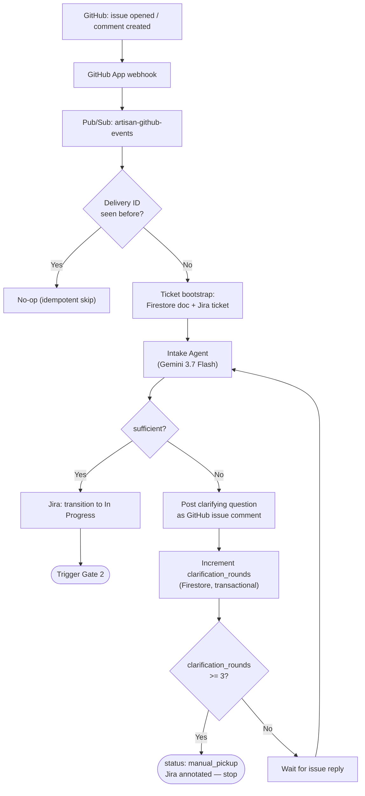

# Artisan — System Design

Companion to [PRD.md](./PRD.md) (what/why) and [TECH_STACK.md](./TECH_STACK.md) (exact versions). This document is the "how": components, data flow, contracts, and state.

## 1. Architecture Overview

```
GitHub repo (issues, issue_comment, pull_request events)
        │  webhook (GitHub App)
        ▼
  Pub/Sub topic: artisan-github-events
        │  push subscription
        ▼
┌───────────────────────────────────────────────────────────┐
│ Cloud Run service: orchestrator                            │
│  - Gate 1: Intake Agent                                    │
│  - Gate 2: routes to Domain-Expert → Planning →            │
│            Execution → Verification agents                 │
│  - Gate 3: Conflict Agent                                   │
│  - All agents: ADK, Gemini 3.7 Flash                        │
└───────────────────────────────────────────────────────────┘
   │              │                    │                │
   ▼              ▼                    ▼                ▼
Firestore    Secret Manager     Cloud Run Jobs      Jira Cloud
(ticket       (GitHub App key,   "execution-        REST API
 state)       Jira token)        sandbox" — one      (direct,
                                 job per attempt:     API-token
                                 clone repo, run      Basic Auth)
                                 plan, run tests,
                                 push branch
   │
   ▼
OpenTelemetry → Cloud Trace / Cloud Logging (every gate decision)

┌───────────────────────────────────────────────────────────┐
│ Next.js dashboard (Cloud Run service)                       │
│  - GitHub OAuth login (repo/issue access as the signed-in   │
│    user)                                                     │
│  - Reads ticket state from Firestore (server-side)          │
│  - Jira status shown via Artisan's own service-account       │
│    credentials (Jira API token) — not the dashboard user's   │
│    personal Jira login                                       │
└───────────────────────────────────────────────────────────┘
```

## 2. Components

| Component | Role | Runs on |
|---|---|---|
| GitHub App | Source of truth for issues/PRs; webhook emitter; PR/comment writer | GitHub |
| Pub/Sub (`artisan-github-events`) | Decouples webhook receipt from processing; at-least-once delivery | Google Cloud |
| Orchestrator service | Owns all 3 gates; hosts Intake, Domain-Expert, Planning, Verification, Conflict agents (all reasoning-only); calls Jira Cloud REST API directly | Cloud Run (service) |
| Execution sandbox | Ephemeral compute that checks out the repo, runs a bounded ADK function-calling agent to write code/tests/docs (own tools: read/write/list/shell + a `finish` signal — never ADK's built-in `bash_tool`, which requires human confirmation per call and would stall unattended), runs the test suite, pushes a branch | Cloud Run Jobs |
| Firestore | Single source of truth for per-ticket state | Google Cloud (native mode) |
| Secret Manager | GitHub App private key, webhook secret, Jira API token | Google Cloud |
| OpenTelemetry → Cloud Trace/Logging | Every gate decision traced (proceed / ask / escalate) | Google Cloud |
| Dashboard | Human-facing view of ticket state, scoped to one repo + board | Cloud Run (service) |

> **Superseded (Sprint 2):** an `mcp-atlassian` MCP server (Cloud Run, internal-only ingress) originally sat between the orchestrator and Jira, per the original design. It was dropped after live testing surfaced an unresolved auth bug in the pinned `sooperset/mcp-atlassian:0.23.1` image itself — two independently-verified-valid API tokens both failed identically through it while succeeding via direct REST calls with the same credentials. The orchestrator now calls Jira Cloud's REST API directly (`agents/src/artisan_agents/jira/client.py`); see `docs/CONTEXT.md` for the full diagnosis. The `mcp-atlassian` Cloud Run service was deleted once this was confirmed (it pulled a public image, so nothing custom was lost).

## 3. Data Flow — Gate 1 (Intake)

1. GitHub emits an `issues` (opened) or `issue_comment` (created) event → GitHub App webhook → Pub/Sub.
2. Orchestrator's Pub/Sub handler deduplicates on GitHub's `X-GitHub-Delivery` header (idempotency key stored in Firestore) and loads/creates the ticket's Firestore document.
3. If the ticket has no Jira key yet, the orchestrator creates one via a direct Jira Cloud REST API call and stores the mapping.
4. Intake Agent reads the GitHub issue thread + Jira ticket and returns a structured verdict: `sufficient` or `insufficient` (with a specific question).
5. **Sufficient:** Jira ticket transitions to *In Progress*; Gate 2 is triggered.
6. **Insufficient:** Artisan posts the specific question as a GitHub issue comment, increments `clarification_rounds` in Firestore, and stops. A reply re-triggers step 4. After 3 rounds still insufficient, the ticket is flagged `manual_pickup` and Jira is annotated accordingly — no further automated attempts.

**Flowchart:**



## 4. Data Flow — Gate 2 (Plan → Execute → Verify → PR)

1. Orchestrator (Gemini 3.7 Flash, high-thinking) decides which domain-expert persona(s) apply (frontend / backend / infra-devops) and whether they run in parallel or in sequence.
2. Domain-expert output (refined technical description) → Planning Agent → a plan (steps, touched files, test cases, doc updates) stored on the Firestore ticket doc.
3. Orchestrator triggers a Cloud Run Job (`execution-sandbox`) with the plan and repo reference as job args (`agents/gcp/cloud_run_jobs.py`, via env-var overrides on a synchronous `run_job(...).result()` call — Cloud Run supports request timeouts up to 60 minutes, so this needs no separate async completion signal at this scope). The job (`execution-sandbox/`): clones the repo, creates a branch, runs a bounded ADK function-calling agent against the plan to write code/tests/docs (never a shelled-out external coding CLI, per PRD §5's non-goal), runs the full test suite, pushes the branch, and writes a structured `ExecutionResult` (success + diff, or failure + logs) directly onto the ticket's Firestore doc for the orchestrator to read back.
4. Verification Agent compares the job's result against the plan and the original issue (short-circuiting to a failed verdict without a model call when the test run itself failed — a red test run can never be verified green).
   - **Green + tests pass:** orchestrator opens the PR (via GitHub App), tagging the issue and summarizing the approach; mirrors the summary as a Jira comment. **Jira status is not transitioned on this path** — this Jira site's real team-managed Kanban workflow only has `Backlog`/`Selected for Development`/`In Progress`/`Done` (confirmed live against `ART-8`/`ART-9` in Sprint 3), with no "PR Open — Awaiting Review" status to move into; the ticket stays *In Progress* in Jira, and the PR link/summary is communicated via the comment instead. Firestore's own `TicketDoc.status` still tracks `"pr_open"` precisely — it, not Jira's coarser workflow, is the source of truth for this state.
   - **Failed verification or failed tests:** specific feedback is appended to the ticket's Firestore doc, `retry_count` increments transactionally (same commit-then-raise shape as Gate 1's clarification cap), and the loop returns to step 2 (Planning) with that feedback in context.
5. On exceeding the retry cap, the ticket is flagged `escalated` with the last failure appended to `escalation_history` (an atomic `firestore.ArrayUnion`, not read-modify-write), and Jira/GitHub are notified — no further automated retries.

**Flowchart:**


## 5. Data Flow — Gate 3 (Merge Conflicts)

1. `pull_request` webhook (synchronize / conflict signal) → Pub/Sub → orchestrator.
2. Conflict Agent classifies the conflict from the diff and conflict markers: `trivial` or `semantic`.
3. **Trivial:** a scratch worktree (inside a Cloud Run Job) attempts resolution; the full test suite must pass there before the resolution is pushed. Failure here escalates immediately — it is not retried indefinitely.
4. **Semantic:** no resolution is attempted. Artisan posts a structured comparison (both sides' intent + diff) as a PR comment and escalates to the maintainer.

## 6. API Contracts

### 6.1 Pub/Sub message (from GitHub webhook)
```json
{
  "delivery_id": "string (GitHub X-GitHub-Delivery, idempotency key)",
  "event": "issues | issue_comment | pull_request",
  "action": "opened | created | synchronize | closed | ...",
  "repo": "owner/name",
  "payload": { "...": "raw GitHub webhook payload, unmodified" }
}
```

### 6.2 ADK agent I/O (all agents exchange typed Pydantic models, not free text)

```python
class IntakeVerdict(BaseModel):
    sufficient: bool
    missing_context_question: str | None = None

class DomainExpertOutput(BaseModel):
    domain: Literal["frontend", "backend", "infra-devops"]
    technical_summary: str
    relevant_files: list[str]

class Plan(BaseModel):
    steps: list[str]
    touched_files: list[str]
    test_cases: list[str]
    doc_updates: list[str]

class ExecutionResult(BaseModel):
    branch: str
    diff_summary: str
    tests_passed: bool
    logs_uri: str

class VerificationVerdict(BaseModel):
    green: bool
    feedback: str | None = None

class ConflictVerdict(BaseModel):
    classification: Literal["trivial", "semantic"]
    resolution_branch: str | None = None
    comparison: str | None = None
```

### 6.3 Dashboard read API (Next.js route handlers, server-side only)
- `GET /api/tickets` → list of ticket summaries (id, Jira key, GitHub issue #, status, current gate, last decision).
- `GET /api/tickets/:id` → full ticket doc: decision trail, retry/clarification counts, PR link, trace links.
- Both routes require an authenticated session (GitHub OAuth) and read from Firestore server-side — the browser never talks to Firestore directly.

### 6.4 Firestore document schema — `tickets/{ticketId}`
```
{
  github_issue_number: number,
  github_repo: string,
  jira_key: string,
  status: "intake" | "in_progress" | "pr_open" | "escalated" | "manual_pickup" | "done",
  clarification_rounds: number,
  retry_count: number,
  domains: string[],
  plan: Plan | null,
  pr_url: string | null,
  escalation_history: [{ at: timestamp, reason: string, gate: "1"|"2"|"3" }],
  trace_ids: string[],
  processed_delivery_ids: string[],   // idempotency
  created_at: timestamp,
  updated_at: timestamp
}
```

## 7. State Management

- **Firestore is the single source of truth per ticket** — every gate reads and writes through it; agents themselves are stateless between invocations.
- **Idempotency:** every webhook delivery ID is checked against `processed_delivery_ids` before any side effect runs, since Pub/Sub delivery is at-least-once.
- **Caps enforced in Firestore, not in agent prompts:** `clarification_rounds` (max 3) and `retry_count` (max N, configurable) are read and incremented transactionally so a race between duplicate deliveries can't bypass a cap.
- **Session/PR mapping:** the ticket doc is the join point between a GitHub issue, a Jira ticket, and (once opened) a PR — the dashboard and every agent resolve identity through this doc, never by re-deriving it from GitHub/Jira directly.

## 8. Auth & Security

- **GitHub → Artisan:** GitHub App installation, webhook secret verified on receipt, private key in Secret Manager, JWT-based installation tokens minted per call (never long-lived PATs).
- **Artisan → Jira:** a single Artisan service account, API token in Secret Manager, used exclusively by the orchestrator (direct Jira Cloud REST API calls, Basic Auth) — end users never authenticate to Jira through Artisan. (Originally routed through an `mcp-atlassian` MCP server; dropped in Sprint 2, see §2.)
- **Artisan → Gemini:** Vertex AI, authenticated via the orchestrator's own service account (ADC) — no API key/secret at all. Requires `GOOGLE_GENAI_USE_VERTEXAI=TRUE` + `GOOGLE_CLOUD_PROJECT` + `GOOGLE_CLOUD_LOCATION=global` env vars on the Cloud Run service and `roles/aiplatform.user` on `orchestrator@` (added Sprint 2 — see `docs/CONTEXT.md`). `location` must be `global`; `gemini-3.7-flash` isn't served from regional endpoints like `us-central1`.
- **Dashboard → user:** GitHub OAuth (Auth.js), scoped to `read:org`/repo access so a signed-in user's dashboard access matches their actual GitHub repo permissions. Jira ticket data is shown as read-only mirrored state (via the service account above), not fetched with the user's own Jira credentials.
- **IAM:** each Cloud Run service/job runs under its own least-privilege service account (orchestrator: Firestore + Pub/Sub + Secret Manager + Vertex AI (`aiplatform.user`) + Cloud Run Jobs-trigger access; execution-sandbox: Firestore write + GitHub App token minting only — the latter means `execution-sandbox@` needs its own `secretAccessor` grant on `github-app-private-key` specifically, added in Sprint 3, since it mints its own installation token rather than being handed one by the orchestrator; dashboard: Firestore read-only).

## 9. Failure Handling & Escalation

- Every retryable step has an explicit cap (3 clarification rounds, N execution retries, 1 attempt at trivial-conflict resolution) — caps live in Firestore, so they survive process restarts.
- The Pub/Sub push subscription has a dead-letter policy (max 5 delivery attempts → `artisan-github-events-dlq`), added in Sprint 2 after a message referencing a nonexistent GitHub issue looped for ~95 minutes with no dead-letter configured — a non-retriable failure (e.g. a 404 that will never resolve) must not retry forever just because the handler raises instead of terminating gracefully.
- Every escalation writes a structured reason (`gate`, `reason`, timestamp) to `escalation_history` and posts a human-readable comment on the GitHub issue/PR and a Jira comment — escalation is always visible in both systems, not just one.
- Nothing transitions to Jira *Done* except a human merge event (`pull_request.closed` with `merged: true`) — this is enforced in the orchestrator, not left to agent judgment.

## 10. Observability

- Every gate decision (proceed / ask / escalate) opens an OpenTelemetry span tagged with `ticket_id`, `gate`, and `decision`; spans export to Cloud Trace.
- Structured logs (Cloud Logging) carry the same `ticket_id` so a full ticket's history can be reconstructed from either trace or log view.
- The dashboard's ticket detail view links directly to the relevant Cloud Trace spans for that ticket.

## 11. Deployment Topology

- Single GCP project, single region.
- Cloud Run services: `orchestrator`, `dashboard`. (`mcp-atlassian`, deployed in Sprint 1, was deleted in Sprint 2 after being superseded — see §2.)
- Cloud Run Jobs: `execution-sandbox` (triggered per attempt, not long-running).
- Pub/Sub: topic `artisan-github-events` with a push subscription to the orchestrator.
- Firestore: native mode, single database.
- Secret Manager: `github-app-private-key`, `github-webhook-secret`, `jira-api-token`.
